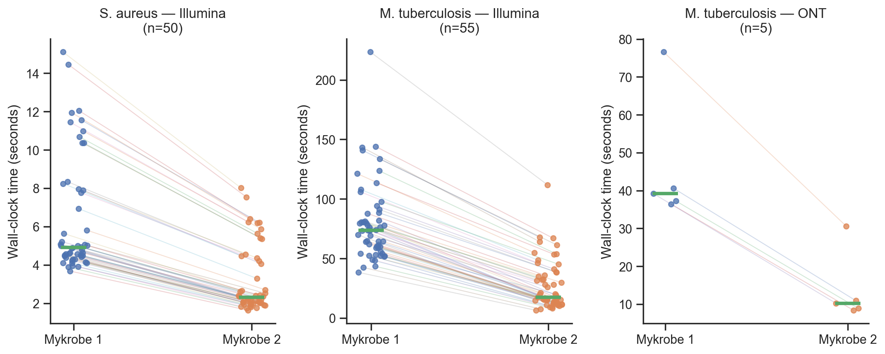
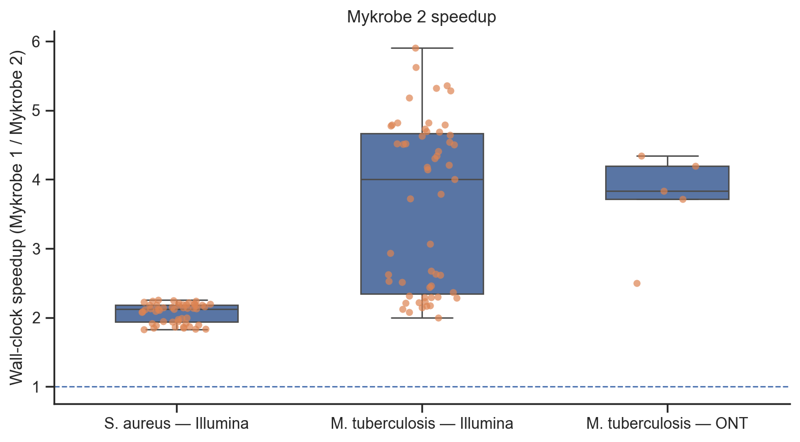
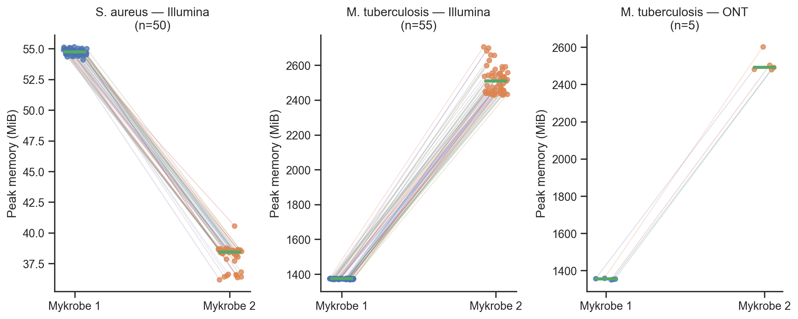

# Mykrobe 1 and Mykrobe2 benchmark

## Versions and benchmark environment

* Mykrobe 1 version 1.13.0, using the released Singularity image
  `mykrobe_v0.13.0.img`.
* Mykrobe2 version 0.1.0-alpha.2.

Benchmarks ran serially on a Linux machine with an AMD Ryzen 5 7560X processor,
32 GB RAM, and CachyOS 7.2.0. Apart from normal background processes, no other
workloads were running.

## Test data

_M. tuberculosis_:

1. Five samples from the Mykrobe Wellcome paper (Hunt et al 2019) with both ONT and
   Illumina runs ([dataset](https://doi.org/10.6084/m9.figshare.7605443)). The
   ONT runs were ERR3078032, ERR3078033, ERR3078034, ERR3078035, and ERR3078036;
   the Illumina runs were ERR3077901, ERR3077902, ERR3077903, ERR3077904, and
   ERR3077905.
2. Fifty Illumina runs, uniformly spaced across the sorted sample list from the
   Wellcome paper's main dataset
   ([dataset](https://doi.org/10.6084/m9.figshare.7556789)).

_S. aureus_:

* Fifty Illumina runs selected uniformly from Staph set A1 in supplementary
  table 1 of the original Mykrobe paper (Bradley et al 2015).


## Methods


### Run accessions

Using the complete supplementary _M. tuberculosis_ and _S. aureus_ data files,
`tb.figshare.tsv` and `mykrobe_staph_st_a1.txt`, respectively, the following
commands created the 50 run-accession lists for each species:

```bash
tail -n +2 tb.figshare.tsv | awk '$1 !~ /\./' | sort -k1,1 | awk '{a[NR]=$1} END {for(i=0;i<50;i++) print a[1+int(i*(NR-1)/49)]}' > tb.illumina_runs.txt

# need the supplementary file in unix TSV format first.
tr -d '\000' < mykrobe_staph_st_a1.txt | tr '\r' '\n' > mykrobe_staph_st_a1.tsv
tail -n +2 mykrobe_staph_st_a1.tsv > mykrobe_staph_st_a1.clean.tsv
tail -n +2 mykrobe_staph_st_a1.clean.tsv \
  | sort -k3,3 \
  | awk '{a[NR]=$3} END {for(i=0;i<50;i++) print a[1+int(i*(NR-1)/49)]}' \
  > staph.samples.txt
```

Run accessions:

* _M tuberculosis_: ERR025833,ERR046946,ERR108445,ERR137233,ERR2199806,ERR227983,ERR2509685,ERR2510373,ERR2510638,ERR2512405,ERR2512670,ERR2512935,ERR2513201,ERR2513466,ERR2513732,ERR2513997,ERR2514263,ERR2514528,ERR2514794,ERR2515059,ERR2515326,ERR2515598,ERR2515863,ERR2516129,ERR2516394,ERR2516660,ERR2516926,ERR2517192,ERR2517457,ERR550776,ERR551507,ERR552299,ERR553055,SRR2100079,SRR2100349,SRR2100617,SRR2100889,SRR2101157,SRR2101460,SRR2101726,SRR5709860,SRR6045108,SRR6045870,SRR6046706,SRR6152842,SRR6153112,SRR6397400,SRR6397676,SRR6398039,SRR671879
* _S. aureus_: ERR418318,ERR418328,ERR418338,ERR418348,ERR418358,ERR418368,ERR418378,ERR418388,ERR418398,ERR418408,ERR418418,ERR418428,ERR418439,ERR418450,ERR418460,ERR418470,ERR418480,ERR418491,ERR418501,ERR418511,ERR418521,ERR418532,ERR418542,ERR418552,ERR418562,ERR418573,ERR418583,ERR418593,ERR418603,ERR418613,ERR418623,ERR418633,ERR418643,ERR418653,ERR418663,ERR418673,ERR418685,ERR418696,ERR418706,ERR418716,ERR418727,ERR418737,ERR418747,ERR418757,ERR418767,ERR418777,ERR418787,ERR418797,ERR418807,ERR418818


### Panels

The latest panels at the time of benchmarking were `tb/202309` and
`staph/20170217`.


### Running the tools

Mykrobe 1 was first run on the initial sample for each species to create the
"skeletons" Cortex files. These files were retained, while all other output
files were deleted, so subsequent runs used the pre-computed skeleton file.
Reads were downloaded from ENA. The following commands are reproduced exactly
as run:

```bash
run=ERR123456 # set for each run

mykrobe_v0.13.0.img predict \
  --sample $run \
  --species staph \
  --seq ${run}_1.fastq.gz \
  --seq ${run}_2.fastq.gz \
   --threads 1 \
   --report_all_calls \
   --format json \
   --output $run.mykrobe-v0.13.0.json

mykrobe2 predict \
  --sample ERR418418 \
  --species staph \
  --seq ${run}_1.fastq.gz \
  --seq ${run}_2.fastq.gz \
   --report-all-calls \
   --format json \
   --output $run.mykrobe2.json
```

### Comparing output JSON files


Mykrobe2 has a hidden `compare-output` command that compares two JSON files. It
checks all relevant content while ignoring version information (for example,
`"version": {"mykrobe-atlas": "mykrobe2", ...}`) and dictionary-entry order.

It was run on every pair of output JSON files as follows:

```bash
run=ERR1234567 # set for each run
mykrobe2 compare-output $run.mykrobe2.json $run.mykrobe-v0.13.0.json
```

The `--report-all-calls` option was used for every Mykrobe run so each output
JSON file contained details for every probe or site in the panel, including:

```json
"genotype": [
  1,
  1
],
"genotype_likelihoods": [
  -604.18162102987,
  -185.7091134382,
  -3.93164151806
],
"info": {
  "contamination_depths": [],
  "copy_number": 0.67283950617,
  "coverage": {
    "klen": 874,
    "kmer_count": 104049,
    "median_depth": 109.0,
    "min_non_zero_depth": 48.0,
    "percent_coverage": 100.0
  },
  "expected_depths": [
    162.0
  ],
}
```

The comparison therefore checks these values between the two files. Each
_M. tuberculosis_ output contains about 119,000 entries; each _S. aureus_
output contains about 500.


### Resource measurement

Each Mykrobe run was prefixed with `/usr/bin/time -v -o $run.mykrobe2.time.txt`
to record resource use.


## Results

### Differences in output

Mykrobe 1 and Mykrobe2 produced identical results apart from rounding
differences. `mykrobe2 compare-output` requires values to agree to nine decimal
places; some genotype likelihoods differed by less than this threshold.

The only reported differences were 16 calls with a `percent_coverage` difference
of 0.01. The relevant `mykrobe2 compare-output` lines are reproduced below.


```
- root.ERR418338.sequence_calls.ant9Ia[0].info.coverage.percent_coverage: left=28.13 right=28.12
- root.ERR418398.sequence_calls.dfrC[0].info.coverage.percent_coverage: left=11.47 right=11.46
- root.ERR418398.sequence_calls.dfrG[0].info.coverage.percent_coverage: left=15.74 right=15.73
- root.ERR418480.sequence_calls.lnuA[0].info.coverage.percent_coverage: left=11.47 right=11.46
- root.ERR418532.sequence_calls.ileS[0].info.coverage.percent_coverage: left=94.2 right=94.19
- root.ERR418532.sequence_calls.lnuA[0].info.coverage.percent_coverage: left=11.47 right=11.46
- root.ERR418603.sequence_calls.dfrK[0].info.coverage.percent_coverage: left=8.81 right=8.8
- root.ERR418797.sequence_calls.lnuB[0].info.coverage.percent_coverage: left=13.82 right=13.81
- root.ERR418807.sequence_calls.dfrC[0].info.coverage.percent_coverage: left=11.47 right=11.46
- root.ERR418807.sequence_calls.vgaALC[0].info.coverage.percent_coverage: left=17.83 right=17.82
- root.ERR418818.sequence_calls.aadEant6Ia[0].info.coverage.percent_coverage: left=11.75 right=11.74
- root.ERR418818.sequence_calls.vgaALC[0].info.coverage.percent_coverage: left=19.31 right=19.3
- root.ERR137233.variant_calls.gid_GCGTTGGCGGGACCCGGTGTGGAGCGGGGGCTGGTGGGACCCCG73GCGTTGGCGGGACCGGTGTGGAGCGGGGCCTGGTGGGACCCCG-CGGGGTCCCACCAGCCCCCGCTCCACACCGGGTCCCGCCAACGC4408087CGGGGTCCCACCAGGCCCCGCTCCACACCGGTCCCGCCAACGC.info.coverage.alternate.percent_coverage: left=3.13 right=3.12
- root.ERR2515326.variant_calls.gid_GCGTTGGCGGGACCCGGTGTGGAGCGGGGGCTGGTGGGACCCCG73GCGTTGGCGGGACCGGTGTGGAGCGGGGCCTGGTGGGACCCCG-CGGGGTCCCACCAGCCCCCGCTCCACACCGGGTCCCGCCAACGC4408087CGGGGTCCCACCAGGCCCCGCTCCACACCGGTCCCGCCAACGC.info.coverage.alternate.percent_coverage: left=3.13 right=3.12
- root.ERR2516926.variant_calls.pncA_GCGT215GCTACCCCCACCCTCGGGGGCGCCGCCCCCGAGTGGCGT-ACGC2289024ACGCCACTCGGGGGCGGCGCCCCCGAGGGTGGGGGTAGC.info.coverage.alternate.percent_coverage: left=40.63 right=40.62
- root.SRR5709860.variant_calls.pncA_GCGT215GCTACCCCCACCCTCGGGGGCGCCGCCCCCGAGTGGCGT-ACGC2289024ACGCCACTCGGGGGCGGCGCCCCCGAGGGTGGGGGTAGC.info.coverage.alternate.percent_coverage: left=28.13 right=28.12
```


### Run time and RAM

The median Mykrobe2 speedup over Mykrobe 1 was 2.1× for _S. aureus_ Illumina,
and 4.0× and 3.8× for _M. tuberculosis_ Illumina and ONT, respectively.

Median peak memory per _S. aureus_ sample fell from approximately 55 MiB to
38 MiB. For _M. tuberculosis_, it increased from approximately 1.4 GiB to
2.5 GiB.

### Plots






